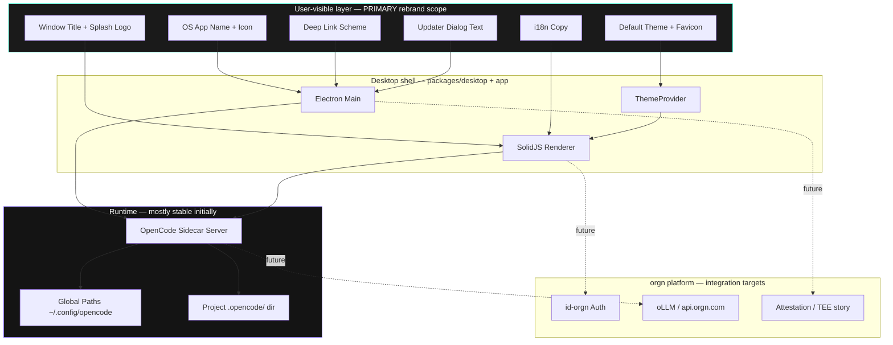

# ORGN Desktop v2 Rebrand Recon Contract

## Status

- Phase: RECON
- Created: 2026-06-06
- Author: Cursor Agent
- Risk Level: **High**

## One-Sentence Summary

Repurpose the `opencode-v2` Electron desktop fork as orgn’s second-generation desktop app by replacing OpenCode user-facing identity (name, logo, colors, copy, distribution metadata) with orgn’s confidential-agentic-IDE brand, while deciding separately whether internal runtime identifiers (config paths, package scopes, CLI names) stay fork-compatible or migrate.

## What Problem Is This Solving?

orgn’s first desktop attempt (`vscode-cde`) is a full VS Code fork — powerful, but heavy to maintain and architecturally divergent from the agent stack orgn already runs in the web product (`orgn/apps/agent` integrates OpenCode server/SDK patterns today).

The team wants a **lighter desktop shell** built from the existing `opencode-v2` monorepo (`packages/desktop` + `packages/app` + `packages/ui` + `packages/opencode` sidecar). That fork still presents as **OpenCode** everywhere a user looks: window title, dock icon, updater copy, deep links, default themes, and marketing strings. Shipping it as orgn without that cleanup would contradict product positioning (“Not through policy. Through math.”) and confuse enterprise buyers evaluating verifiable trust.

Think of it like moving into a furnished apartment: the plumbing works, but every wall still has the previous tenant’s name on the mailbox, lease, and welcome mat. This ticket is the inventory of every place that name appears — and which walls are load-bearing vs. cosmetic.

## Common Misreadings

| Likely wrong interpretation | Why it's wrong | What this ticket actually is |
|---|---|---|
| “Rename `@opencode-ai/*` packages to `@orgn/*`” | Package scopes are build-time identifiers; renaming all 20+ workspace packages breaks upstream mergeability and is not user-visible | **User-visible rebrand first**; internal scopes are a separate fork-strategy decision |
| “Swap the logo SVG and ship” | Branding spans Electron metadata, 15+ i18n locales, theme defaults, deep links, updater strings, WSL install flows, and OpenCode config directory conventions | A **surface-area audit + phased replacement plan** |
| “Apply the web app’s shadcn/Tailwind design system wholesale” | Desktop v2 is **SolidJS + `@opencode-ai/ui` theme JSON**, not Remix/React; different component primitives | **Translate orgn design philosophy** into the desktop theme system and logo components |
| “Delete all OpenCode infrastructure (SST, console, stats)” | Those packages may remain for fork sync or be out of desktop v2 scope | Desktop v2 rebrand focuses on **`packages/desktop`, `packages/app`, `packages/ui`, and user-touching core paths** |
| “Use the `orng` theme — we’re done” | `orng.json` uses orange `#EC5B2B` (proven in repo); orgn’s current design tokens use **Spectral Teal `#2FFFD7`, Electric Violet `#7A5CFF`, pure black surfaces** (proven in `orgn/apps/agent/styles/security-tokens.css` and `.cursor/commands/ui-design.mdc`) | Need a **new default orgn desktop theme**, not a rename of `orng` |

---

## Feature Request

Replace all OpenCode branding in the `opencode-v2` desktop product path with orgn branding, aligned with:

1. **Product context** — `.cursor/rules/orgn-product-context.mdc` (confidential agentic IDE, TDX trust model, “Run anything. See nothing.”)
2. **v1 desktop design philosophy** — `vscode-cde` (black chrome, orgn launchpad, id-orgn auth hooks, “CDE” product naming)
3. **Web app design philosophy** — `orgn/apps/agent` (Berkeley Mono typography, security token palette, sharp/brutalist rules in agent UI docs)

Target outcome: a user installing the Electron app sees **orgn**, not OpenCode, with visual and verbal identity consistent with existing orgn surfaces.

## Problem Statement

`opencode-v2` is a downstream fork of [anomalyco/opencode](https://github.com/anomalyco/opencode) (proven: root `package.json` repository URL). It inherits:

- OpenCode product names in Electron packaging
- OpenCode logo/wordmark SVG components
- OpenCode-default theme (`oc-2`) and theme storage keys prefixed `opencode-`
- XDG config/data directories named `opencode` under `~/.config`, `~/.local/share`, etc.
- Hundreds of user-facing i18n strings referencing “OpenCode”
- Deep link scheme `opencode://` and app IDs `ai.opencode.desktop*`
- Sidecar auth defaults (`username: "opencode"`)
- Optional `orng` / `lucent-orng` themes that partially echo orgn orange but **do not match** current orgn token spec

Without a deliberate rebrand contract, implementation will either miss user-visible surfaces or accidentally break config compatibility with existing orgn web integrations that still speak OpenCode SDK/protocol shapes.

## User Journey

### Current (proven in repo)

1. User downloads **OpenCode** (productName from `electron-builder.config.ts`)
2. App opens with `<title>OpenCode</title>` (`packages/desktop/src/renderer/index.html`)
3. Splash shows OpenCode mark SVG (`packages/ui/src/components/logo.tsx` — geometric “OpenCode” wordmark paths)
4. Default theme is **OC-2** (`packages/ui/src/theme/context.tsx` — fallback `"oc-2"`)
5. Desktop spawns local OpenCode server sidecar; stored settings use keys like `opencode.global.dat`, `opencode.settings`
6. User may connect WSL distros and install/update **OpenCode** CLI (`packages/app/src/wsl/settings-model.ts`)
7. Deep links arrive as `opencode://…` (`packages/desktop/src/renderer/index.tsx` — event `opencode:deep-link`)

### Proposed (inferred — needs product sign-off)

1. User downloads **orgn** (or **CDE** — see unknowns)
2. Launch experience shows orgn wordmark (reuse assets from `vscode-cde/.../orgnLogoWordmark.svg` or net-new)
3. Default theme is orgn-branded (monochrome + signal colors)
4. Auth flows through **id-orgn** (parity with v1 `product.json` `idOrgn` block)
5. Sidecar routes inference through **oLLM / orgn API** where applicable
6. Deep links use orgn scheme (e.g. `orgn://` or `cde://`)

## Existing System Reality

### Three codebases, three branding layers

| Layer | v1 Desktop (`vscode-cde`) | Web (`orgn`) | Target (`opencode-v2`) |
|---|---|---|---|
| **Product name** | “CDE” short / long (`product.json`) | “orgn” / orgn.com | “OpenCode” (`electron-builder.config.ts`, `APP_NAMES` in `desktop/src/main/index.ts`) |
| **Visual ground** | Pure `#000000`, `#1F1F1F` borders (`orgn_cde_black.json`) | Ghost gray `#141414`, security tokens | Default `oc-2` multicolor theme |
| **Typography** | VS Code system font in launchpad | Berkeley Mono everywhere (`remix-app/globals.css`) | Desktop UI fonts via `@opencode-ai/ui` (theme-driven) |
| **Logo** | `orgnLogoWordmark.svg`, mark variants (proven) | Branded mono uppercase labels in components | OpenCode SVG logo (`logo.tsx`) |
| **Auth** | `idOrgn` in `product.json` → launchpad sign-in | Stack Auth + id-orgn (`apps/agent/lib/auth/`) | OpenCode provider/oauth flows (upstream) |
| **Agent runtime** | VS Code chat + oLLM extension paths | OpenCode SDK client (`apps/agent/lib/opencode/`) | Embedded `@opencode-ai/opencode` sidecar |
| **Worktree namespace** | CDE projects / trial branches | Migrating `opencode/` → `orgn/` branches (proven in `apps/agent/tests/unit/utils/trial-branch-namespace.test.ts`) | `opencode/{name}` branches (proven in orgn architecture doc) |

### orgn design philosophy (authoritative sources)

**Product positioning** (`.cursor/rules/orgn-product-context.mdc`):

- Confidential agentic development environment on Intel TDX
- “Not through policy. Through math.” / “Run anything. See nothing.”
- Avoid SGX “enclave” language; use **Trust Domain**

**Visual rules** (`.cursor/commands/ui-design.mdc` — agent context, proven in repo):

- Monochrome surfaces; color only for signal
- Sharp corners (`border-radius: 0`)
- Space Mono headings, RM Neue body, JetBrains Mono terminal
- Spectral Teal `#2FFFD7`, Electric Violet `#7A5CFF`, Pure Black `#000000`, Ghost Gray `#141414`

**Web app implementation reality** (`orgn/apps/agent/remix-app/globals.css`):

- **Berkeley Mono** is the actual shipped UI font (`--app-font-family`), not Space Mono/RM Neue
- Security tokens in `styles/security-tokens.css` scoped to `[data-security]`
- Tailwind v4 + shadcn for general UI; separate `security-primitives` for brutalist components

**v1 desktop implementation reality** (`vscode-cde`):

- `ORGN CDE Black` theme: all major chrome `#000000`, accent `#0078D4` on active tab top border
- Launchpad: centered orgn wordmark, black overlay, minimal copy (`orgnLaunchpad.css`)
- Product still named **CDE** in `product.json`, not “orgn” — installer directory `win32DirName: "orgn"`

### opencode-v2 architecture (desktop path)

```
Electron main (packages/desktop/src/main)
  → spawns OpenCode server sidecar (packages/opencode)
  → loads SolidJS renderer (packages/desktop/src/renderer → @opencode-ai/app)
  → UI components (@opencode-ai/ui)
  → Theme JSON → CSS variables (packages/ui/src/theme)
```

Key constants (proven):

```typescript
// packages/core/src/global.ts
const app = "opencode"
const config = path.join(xdgConfig!, app)  // ~/.config/opencode
```

```typescript
// packages/desktop/electron-builder.config.ts (prod channel)
appId: "ai.opencode.desktop"
productName: "OpenCode"
protocols: { schemes: ["opencode"] }
```

```typescript
// packages/ui/src/theme/context.tsx
STORAGE_KEYS = {
  THEME_ID: "opencode-theme-id",
  COLOR_SCHEME: "opencode-color-scheme",
  ...
}
defaultTheme fallback: "oc-2"
```

### Partial orgn-adjacent work already in fork

| Artifact | Location | Notes |
|---|---|---|
| `orng` theme | `packages/ui/src/theme/themes/orng.json` | Orange `#EC5B2B` primary — **not** current orgn token palette |
| `lucent-orng` theme | `packages/ui/src/theme/themes/lucent-orng.json` | Warm tinted neutral `#fff5f0` light mode |
| CLI bin name `lildax` | `packages/cli/package.json` | Suggests prior rename experiment; user strings still say `opencode` command |
| Web integration doc | `orgn/docs/opencode-providers-desktop-implementation.md` | orgn web already mirrors desktop SDK provider fetch pattern |

---

## Similar Implementations Found

| Pattern | Location | Why It Matters |
|---|---|---|
| Electron product metadata | `packages/desktop/electron-builder.config.ts`, `desktop/src/main/index.ts` | Single source for app name, ID, protocol scheme, artifact names |
| Logo components | `packages/ui/src/components/logo.tsx` | Inline SVG paths spell “OpenCode” geometrically — must replace, not string-swap |
| Theme system | `packages/ui/src/theme/context.tsx`, `themes/*.json` | Brand colors flow through JSON → CSS vars; add `orgn` theme + change default |
| i18n string tables | `packages/desktop/src/renderer/i18n/*.ts`, `packages/app/src/i18n/*.ts`, `packages/ui/src/i18n/*.ts` | 15+ locales × updater/CLI/WSL strings |
| orgn launchpad + logo assets | `vscode-cde/src/vs/workbench/contrib/welcomeOrgnLaunchpad/` | Reusable wordmark SVG (`orgnLogoWordmark.svg`) and black-screen launch pattern |
| orgn color theme (VS Code) | `vscode-cde/extensions/theme-defaults/themes/orgn_cde_black.json` | Monochrome surface reference for desktop theme JSON |
| Design tokens (web) | `orgn/apps/agent/styles/security-tokens.css` | Authoritative hex values for orgn palette |
| id-orgn auth wiring | `vscode-cde/product.json` `idOrgn` block | Template for desktop v2 auth integration |
| Branch namespace migration | `orgn/apps/agent/tests/unit/utils/trial-branch-namespace.test.ts` | orgn already dual-reads `opencode/` and `orgn/` branch prefixes |
| Provider SDK parity | `orgn/docs/opencode-providers-desktop-implementation.md` | Sidecar API contract should remain stable even if brand changes |

---

## Data Journey

### Current Flow

1. **Build time** — `OPENCODE_CHANNEL` env selects dev/beta/prod naming (`electron-builder.config.ts`, `desktop/src/main/constants.ts`)
2. **Install time** — OS registers `opencode://` protocol, installs to OpenCode-named bundle
3. **First launch** — Renderer reads `localStorage` keys `opencode-theme-id`, `opencode-color-scheme`; defaults to `oc-2`
4. **Settings persistence** — Electron store `opencode.settings`; global dat `opencode.global.dat` (`desktop/src/main/constants.ts`, renderer i18n)
5. **Sidecar boot** — Main spawns server; auth defaults `username: "opencode"` (`packages/opencode/src/server/auth.ts`, WSL sidecar)
6. **Project config** — Repo-local `.opencode/` directory for agents, skills, tools (hundreds of test references)
7. **Global config** — `~/.config/opencode/opencode.json` loaded by `packages/opencode/src/config/config.ts`
8. **UI render** — Solid components consume `--icon-*`, `--surface-*` CSS vars from theme resolver
9. **Updates** — `electron-updater` checks GitHub `anomalyco/opencode` (prod channel config)

### Proposed Flow

1. **Build time** — `ORGN_CHANNEL` or reuse channel machinery with orgn product names / app IDs
2. **Install time** — Register orgn protocol; bundle named orgn (or CDE)
3. **First launch** — Default theme `orgn`; storage keys namespaced (`orgn-theme-id`) *or* migrate reads from legacy keys
4. **Settings** — orgn-prefixed store keys with optional migration from `opencode.*`
5. **Sidecar** — Same server process initially; auth username/branding strings updated
6. **Project config** — **Decision required**: keep `.opencode/` for compatibility vs. introduce `.orgn/` with dual-read
7. **Global config** — **Decision required**: keep `~/.config/opencode` vs. `~/.config/orgn` with migration
8. **UI render** — New `orgn.json` theme matching v1 black + web tokens
9. **Updates** — orgn-controlled update URL (pattern: v1 `product.json` `updateUrl` → DigitalOcean spaces)

---

## Architecture Diagram



## Sequence Diagram

Ordering matters for first launch + theme + sidecar:

```mermaid
sequenceDiagram
  participant User
  participant Electron as Electron Main
  participant Renderer as Solid Renderer
  participant Theme as ThemeProvider
  participant Sidecar as OpenCode Server
  participant FS as Config FS

  User->>Electron: Launch app
  Electron->>Electron: Set app name (OpenCode → orgn)
  Electron->>Sidecar: spawn serve
  Sidecar->>FS: read ~/.config/opencode/*
  Electron->>Renderer: load window
  Renderer->>Theme: init defaultTheme
  Theme->>Theme: read localStorage opencode-theme-id
  Theme->>Renderer: apply oc-2 CSS vars
  Renderer->>User: Show OpenCode splash + UI

  Note over User,FS: After rebrand — Theme defaults orgn.json;<br/>storage migration; splash uses orgn logo
```

---

## Service Inventory

| Service / Module | Current Responsibility | Expected Role | Failure Mode |
|---|---|---|---|
| `packages/desktop` | Electron shell, updater, deep links, WSL | orgn-branded shell; orgn update endpoint | Wrong app ID breaks auto-update codesign chain |
| `packages/app` | SolidJS IDE UI, i18n, WSL settings | orgn copy; id-orgn entry flows (future) | Broken i18n keys show raw tokens |
| `packages/ui` | Components, themes, logo SVG | orgn logo + `orgn` default theme | Theme JSON schema mismatch → unstyled UI |
| `packages/opencode` | Agent server, config loader, `.opencode/` | Runtime engine; branding strings in errors/CLI | Config path rename breaks existing user projects |
| `packages/core` | Global paths (`app = "opencode"`) | Path strategy decision | Data loss if migration skipped |
| `packages/cli` | CLI binary (`lildax` bin name) | orgn CLI naming TBD | Docs/scripts reference wrong command |
| `packages/console/*`, `packages/web`, `packages/stats/*` | OpenCode SaaS/marketing | Likely **out of desktop v2 scope** | Accidental scope creep |
| `vscode-cde` (reference) | v1 desktop patterns | Design reference only | Not modified in this effort |
| `orgn/apps/agent` (reference) | Web product + SDK integration | Token/auth reference | N/A |

---

## Data Shapes

### Electron product config (current — proven)

```typescript
// packages/desktop/electron-builder.config.ts (prod)
{
  appId: "ai.opencode.desktop",
  productName: "OpenCode",
  artifactName: "opencode-desktop-${os}-${arch}.${ext}",
  protocols: { name: "OpenCode", schemes: ["opencode"] },
  publish: { provider: "github", owner: "anomalyco", repo: "opencode" }
}
```

### Theme storage keys (current — proven)

```typescript
// packages/ui/src/theme/context.tsx
const STORAGE_KEYS = {
  THEME_ID: "opencode-theme-id",
  COLOR_SCHEME: "opencode-color-scheme",
  THEME_CSS_LIGHT: "opencode-theme-css-light",
  THEME_CSS_DARK: "opencode-theme-css-dark",
} as const
```

### Desktop theme JSON schema (current — proven)

```json
{
  "$schema": "https://opencode.ai/desktop-theme.json",
  "name": "OpenCode",
  "id": "opencode",
  "dark": {
    "palette": {
      "neutral": "#0a0a0a",
      "ink": "#eeeeee",
      "primary": "#fab283"
    }
  }
}
```

### Proposed orgn desktop theme (inferred — needs design review)

```json
{
  "$schema": "https://opencode.ai/desktop-theme.json",
  "name": "ORGN",
  "id": "orgn",
  "dark": {
    "palette": {
      "neutral": "#000000",
      "ink": "#FFFFFF",
      "primary": "#2FFFD7",
      "accent": "#7A5CFF",
      "interactive": "#7A5CFF",
      "success": "#2FFFD7",
      "error": "#ff3333",
      "info": "#4FA8FF"
    }
  }
}
```

### v1 id-orgn product block (reference — proven in vscode-cde)

```json
{
  "idOrgn": {
    "url": "https://id.orgn.com",
    "clientId": "5e211916d922874a473a499f4d5e04ad12e8a09697468875",
    "providerId": "id-orgn",
    "signUpUrl": "https://id.orgn.com/sign-in"
  },
  "cde": {
    "apiUrl": "https://api.orgn.com",
    "appUrl": "https://cde.orgn.com",
    "attestationBaseUrl": "https://attest.daytona.orgn.com"
  }
}
```

---

## Trust Boundaries

| Boundary | What Crosses It | Protection Needed |
|---|---|---|
| Desktop ↔ Sidecar (localhost) | Session data, prompts, code context | Preserve localhost auth; rotate default username intentionally |
| Desktop ↔ id-orgn | OAuth tokens, team identity | PKCE/OAuth exact redirect URIs; new desktop bundle ID must be registered |
| Desktop ↔ oLLM/api.orgn.com | Model inference payloads | TLS + orgn auth headers; no plaintext egress from TEE story |
| Desktop ↔ Update server | Binaries, signatures | orgn-controlled signing/notarization pipeline — not GitHub anomalyco |
| Renderer ↔ External URLs | Help links, favicons (`opencode.ai`) | Replace with orgn.com / id.orgn.com allowlist |
| Config on disk | `~/.config/opencode`, `.opencode/` | Migration plan if paths change; avoid orphaning secrets |

---

## Attack Surface

| Risk | Where | Mitigation |
|---|---|---|
| Open redirect via deep links | `packages/app/src/pages/layout/deep-links.ts` | Validate orgn scheme handlers; allowlist paths |
| XSS in shared session UI | `packages/ui` markdown/session components | Keep DOMPurify/marked sanitization; retest after theme injection |
| Auth username default leakage | `server/auth.ts`, WSL sidecar | Document default creds; force password setup in orgn mode |
| Update channel hijack | `electron-updater` GitHub config | Point to orgn-signed update infra |
| Residual telemetry to OpenCode | Sentry, stats packages | Audit `packages/desktop`, `@sentry/solid` DSNs and stats ingest |
| Config path migration race | Dual `.opencode`/`.orgn` | Idempotent migration; file locks via existing `Flock` |
| Brand phishing confusion | Similar logos | Use canonical orgn wordmark from v1 assets |

---

## Dependency Blast Radius

| Area | Files | Risk |
|---|---|---|
| **P0 — User visible** | `packages/desktop/electron-builder.config.ts`, `desktop/src/main/index.ts`, `renderer/index.html`, `packages/ui/src/components/logo.tsx`, `packages/ui/src/theme/context.tsx`, all `i18n/*.ts` with “OpenCode” | Medium — mechanical but wide |
| **P0 — Icons** | `packages/desktop/resources/icons/*` (referenced in builder config; icons not in minimal checkout — **unknown if generated**) | High if missing from repo |
| **P1 — Default theme** | New `themes/orgn.json`, `default-themes.ts`, `context.tsx` default | Medium — visual QA needed |
| **P1 — Storage keys** | `opencode-theme-id`, `opencode.settings`, `opencode.global.dat` | Medium — needs migration |
| **P2 — Config paths** | `packages/core/src/global.ts`, `config/config.ts`, `.opencode/` convention | **High** — breaking change |
| **P2 — Package scopes** | All `@opencode-ai/*` package.json names | High — fork maintenance |
| **P3 — Out of scope** | `packages/console/*`, `packages/web`, `packages/stats/*`, `sst.config.ts`, `infra/*` | Low if explicitly excluded |
| **Reference only** | `vscode-cde/**`, `orgn/apps/agent/**` | None — read for patterns |
| **Tests** | `packages/app/src/theme-preload.test.ts`, WSL tests, hundreds of `.opencode/` test fixtures | Medium — update assertions |

### Files that should NOT change (initially)

- OpenCode server API routes / SDK OpenAPI shape (`packages/sdk/openapi.json`) — orgn web depends on compatibility
- Core agent/session logic unless required for auth routing
- Upstream merge-sensitive renames without strategy

---

## Unknowns

| Unknown | Why It Matters | How To Resolve |
|---|---|---|
| Shipping name: **orgn** vs **CDE** vs **orgn CDE** | v1 uses CDE in window title but orgn in installer dir; product context says “orgn” externally | Product/design sign-off |
| Config directory migration: keep `opencode` vs migrate to `orgn` | Breaking change for users and orgn web CodeSandbox mode paths | Phase 0 spike: dual-read prototype in `Global.Path` |
| CLI command name (`opencode` vs `orgn` vs `lildax`) | Affects docs, WSL install scripts, terminal UX | Align with web sandbox conventions (`orgn` paths proven in tests) |
| Deep link scheme (`orgn://` vs `cde://`) | OS protocol registration + id-orgn redirect URIs | Register with identity team |
| Update/signing infrastructure | Currently GitHub `anomalyco/opencode` | Mirror v1 DigitalOcean / orgn pipeline |
| Icon asset source of truth | `resources/icons` referenced but not fully present in listing | Locate or regenerate from orgn brand assets |
| Font strategy on desktop | Web uses Berkeley Mono; design docs specify Space Mono/RM Neue | Typography decision for Solid UI |
| id-orgn + oLLM integration scope | Rebrand-only vs rebrand+auth in v2.0 | Separate contract or Phase 2 |
| Console/web/stats packages | Fork noise vs deletion | Explicit non-goals |
| TEE attestation surfacing in desktop v2 | Core orgn differentiator | Product priority call |

---

## Proposed Implementation Strategy

High-level phases only — no code in RECON.

### Phase 0 — Decisions (blocking)

1. Product name, app ID, protocol scheme, update URL
2. Config path strategy: **compat mode** (keep `opencode` paths, orgn skin) vs **migrate mode**
3. Typography + default theme spec (map `security-tokens.css` → desktop theme JSON)
4. Scope boundary: desktop packages only vs whole monorepo

### Phase 1 — User-visible rebrand (low breaking risk)

1. Replace logo components with orgn wordmark/mark (import from `vscode-cde` SVGs)
2. Update Electron `productName`, `appId`, window title, dock icon
3. Replace i18n strings (English first, then locale batch)
4. Add `orgn.json` theme; set as default; hide or demote `opencode`/`oc-2` themes
5. Replace external URLs (`opencode.ai` favicon, help links)
6. Update deep link event names and protocol registration

### Phase 2 — Persistence + distribution

1. Storage key migration (`opencode-*` → `orgn-*`) with read-fallback
2. orgn update server + code signing
3. Installer artifact naming (`orgn-desktop-*`)
4. WSL/CLI install copy updates

### Phase 3 — Platform integration (may be separate tickets)

1. id-orgn auth (mirror `vscode-cde` launchpad flow in Solid)
2. oLLM provider routing via `api.orgn.com`
3. Attestation status UI
4. Branch namespace default `orgn/` for new worktrees

### Phase 4 — Optional internal rename

1. `@opencode-ai/*` → `@orgn/*` if fork independence prioritized over upstream merges
2. `Global.Path` app slug migration with tooling

---

## Acceptance Criteria

- [ ] Installed macOS/Windows/Linux app displays **orgn** (or approved name) in dock/taskbar, About panel, and window title — zero “OpenCode” strings in primary UI (English)
- [ ] Splash/logo uses orgn wordmark; no OpenCode geometric letterforms in `logo.tsx`
- [ ] Default theme is orgn-branded dark monochrome with Spectral Teal signal color (matches token spec within desktop theme constraints)
- [ ] Electron `appId`, protocol scheme, and artifact names use orgn namespace — not `ai.opencode.desktop`
- [ ] Updater dialogs reference orgn, not OpenCode
- [ ] No hardcoded `opencode.ai` URLs in desktop/app/ui packages (except documented upstream proxy exceptions if kept)
- [ ] Deep links register under orgn scheme
- [ ] Visual review against v1 launchpad black screen + web security tokens documents intentional alignment
- [ ] OpenCode SDK/API compatibility preserved for orgn web integration (sidecar endpoints unchanged)

## Non-Goals

- Rewriting agent logic in `packages/opencode`
- Migrating orgn web app from Remix to Solid
- Rebranding OpenCode console/marketing site inside this fork (unless explicitly scoped)
- Renaming all `@opencode-ai/*` packages in Phase 1
- Changing OpenAPI/SDK public types consumed by `orgn/apps/agent/lib/opencode/`
- Implementing full TEE attestation UI (unless scoped as Phase 3)

## Recommended Next Step

Run **Phase 0 decision workshop** (30–60 min) to lock:

1. External product name
2. Config compat vs migrate
3. Phase 1 scope sign-off

Then produce `02-plan.md` with file-by-file edit list starting at:

- `packages/ui/src/components/logo.tsx`
- `packages/ui/src/theme/themes/orgn.json` (new)
- `packages/desktop/electron-builder.config.ts`
- `packages/desktop/src/main/index.ts`
- `packages/desktop/src/renderer/index.html`
- `packages/desktop/src/renderer/i18n/en.ts` (template for locale sweep)
